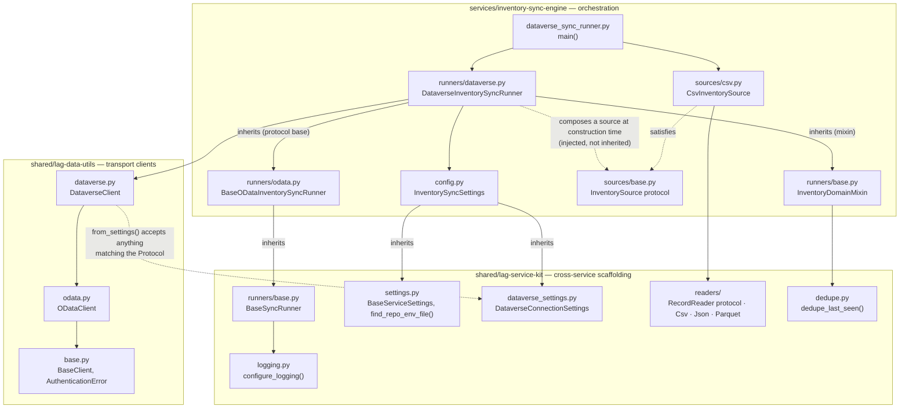
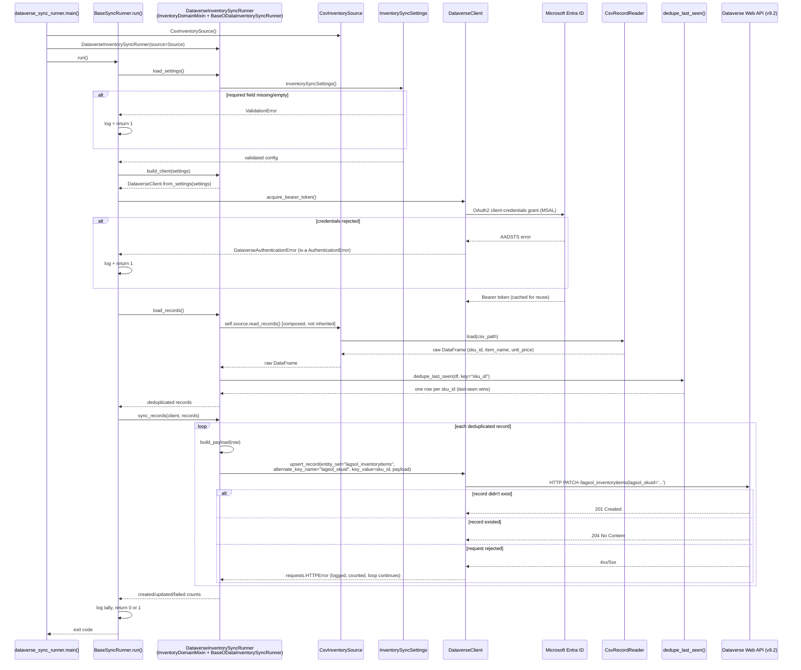

# LAG Dataverse OData Sync Engine

A Python service that migrates ERP inventory data into Microsoft Dataverse via 
the OData Web API, utilizing an extensible, multi-layer architecture designed 
to readily adopt alternative enterprise destination systems.

## The business problem

Inventory data lives in an ERP system as a flat, append-only feed. Microsoft
Dataverse — the system of record for downstream Power Platform apps — needs
that data kept in sync.  This sync should be maintained without creating 
duplicate records, without needing manual reconciliation, and without making 
format assumptions related to the source or destination.

This solution  solves three key problems:

1. **Sync inventory records into Dataverse idempotently.** The sync prevents
   record duplication, preventing the creation of duplicate or corrupt records, 
   even when prior runs fail.
2. **Source and Destination Agnostic.** Modular architecture separates the
   service kit from the service- supporting various source and destination
   formats (e.g. CSV, JSON, Parquet) and solutions.
3. **Operable beyond simple execution.** Structured machine-parseable logs, 
   validated configuration, and strict typing make failures diagnosable in 
   production and support integration with external log solutions
   (e.g. Azure Monitor Log Analytics, Datadog, ELK Stack, etc.)

## Architecture

The repository is split into three layers, supporting separation of concerns.
Each layer holds a single responsibility and one-way dependency on the layer 
below it:



| Layer | Package | Owns | Must never contain |
|---|---|---|---|
| Transport | `shared/lag-data-utils` | HTTP/OData mechanics, MSAL auth, Dataverse-specific headers, the `AuthenticationError` hierarchy | Environment reads, a config framework, business logic |
| Scaffolding | `shared/lag-service-kit` | Settings base classes, structured logging, input-format readers, generic dedup, the source- and destination-agnostic `BaseSyncRunner` orchestration algorithm (generic over the transport client type) | Dataverse-specific, inventory-specific, or source-format-specific knowledge |
| Orchestration | `services/inventory-sync-engine` | Three independent things that combine, never duplicate: the domain mixin `InventoryDomainMixin` (dedup, source binding), one write-protocol base per wire protocol (`BaseODataInventorySyncRunner` today), and one destination leaf class per target system (`DataverseInventorySyncRunner`, combining exactly one of each) — plus, on a wholly separate axis, one `InventorySource` per feed format (`CsvInventorySource` today), composed into a runner by the caller | Anything reusable by a service that isn't this one |

Three axes vary independently here, and each stays a single point of
definition:

- **Source format** (`sources/`) — composed into a runner at
  construction time, never inherited.
- **Write protocol** (`runners/odata.py`, and future siblings) — a base
  class per protocol, combined into a leaf via multiple inheritance.
- **Destination system** (`runners/dataverse.py`, and future siblings) —
  the leaf class itself, combining one domain mixin with one protocol
  base.

A runner is *given* a source object; it never subclasses one. A
destination leaf *combines with* a protocol base via multiple
inheritance, rather than reimplementing the write loop, because the
write loop and the domain/dedup logic are both class-level, structural
concerns fixed for the lifetime of that leaf class — unlike the source,
which is a per-run operational choice.

### Three Layered Approach

A typical split calls for "library vs. application" — transport code in
`lag-data-utils`, everything else in the service. That approach fails to
support additional services (e.g., config loading, logging setup, and 
"read this file format into a DataFrame").  Each new service would result in 
duplicated code or a bloated transport layer, compromising the clean boundaries 
of `lag-data-utils`, therefore preventing delivery of a clean and maintainable 
transport layer.

`lag-service-kit` exists to hold code and logic that is reusable across
*any* future service independent of any transport concern. This approach 
prevents the transport layer dependency on any specific configuration framework. 
Concretely:

- `lag-data-utils` has zero dependency on Pydantic or any settings library.
  `DataverseClient.from_settings()` is typed against a structural
  `typing.Protocol` (`DataverseConnectionSettings` in `dataverse.py`) —
  any object exposing the right four attributes works, regardless of what
  produced it.
- `lag-service-kit` depends on Pydantic and pandas, but knows nothing about
  Dataverse alternate keys or inventory columns — any service that talks to
  a different destination system or ingests a different kind of record can
  leverage this kit out of the box.
- The service's destination-specific leaf class is the thinnest layer - housing 
  specific implementations for the destination system. 
    - `DataverseInventorySyncRunner` (`runners/dataverse.py`) contributes 
    only methods specific to Microsoft Dataverse integrations: `entity_set`,
    `alternate_key_field`, `load_settings()`, `build_client()`, and
    `build_payload()`.
    - It does **not** inherit its source feed. Which feed format a run reads
    is composed in at construction time — `DataverseInventorySyncRunner(source=CsvInventorySource())`
    in `dataverse_sync_runner.py` — via any object satisfying the
    `sources.InventorySource` protocol (`sources/base.py`). A destination
    inheriting from a source class would fix that destination to one feed
    format forever; composition lets the same `DataverseInventorySyncRunner`
    read CSV today and JSON tomorrow with no new class.
    - It **does** inherit two independent bases, combined via multiple
    inheritance: `InventoryDomainMixin` (`runners/base.py` — dedup, source
    binding) and `BaseODataInventorySyncRunner` (`runners/odata.py` — the
    OData v4 upsert loop). Neither base depends on or duplicates the
    other; a class combining both gets dedup, source binding, and the
    write loop with each defined in exactly one place.
    - `dataverse_sync_runner.py` is reduced to implementation-specific business
    logic - identifying the leaf class to instantiate, which source to pair
    it with, and running it.

### Layering Patterns

The transport hierarchy (`BaseClient` → `ODataClient` → `DataverseClient`)
goes beyond simply being reserved for connectors — services like the sync runner 
are built the same way, for the axis that genuinely is a hierarchy.
  - A base class owns core implementation pieces that are vital to any
  integration and rarely vary.
  - Each concrete class inheriting from the base class and other mid-layer
  abstractions contributes methods and state specific to the subject
  implementation.

Not every axis of variation is a hierarchy, though. Where two axes vary
*independently* — as source format and destination system do here —
forcing them into one inheritance chain produces either a combinatorial
explosion of classes (`CsvDataverseRunner`, `JsonDataverseRunner`,
`CsvSapRunner`, `JsonSapRunner`, ...) or an arbitrary, incorrect coupling
(a destination that can only ever read one feed format). The sync runner
therefore uses inheritance for the destination axis and composition for
the source axis.

#### Our Example: LAG Service Kit

The Service Kit combines three techniques, one per axis of variation:
dependency injection for the source (an operational, per-run choice),
mixin composition for domain logic and write protocol (two class-level
concerns that must each stay defined exactly once), and template method
for the parts of the algorithm every run shares regardless of any axis.

- `lag_service_kit.runners.base.BaseSyncRunner` — the outermost, fully
  generic layer. Knows the *shape* of a sync run (load settings → configure
  logging → authenticate → read records → write records → report results)
  but makes no direct implementation or reference to the shape or type of the 
  source or destination. It lives in the kit in lieu of any particular service
  to support other service implementations that require this same shape.
  It is generic over `ClientT` (bound to `lag_data_utils.clients.base.BaseClient`),
  so every subclass in a given hierarchy agrees on one concrete client
  type for `build_client()` and `sync_records()`, rather than each
  narrowing it independently.
- `services/inventory-sync-engine/runners/base.py:InventoryDomainMixin`
  — the inventory-domain layer. Knows what an inventory record is
  (`sku_id`, `item_name`, `unit_price`) and how to dedupe it. Knows
  nothing about what source feed produced a record, which wire protocol
  writes it, or which destination it's going to — its constructor takes
  a `source: InventorySource` collaborator, and `load_records()` calls
  `self.source.read_records()`. It does not inherit `BaseSyncRunner` at
  all: it commits to no `ClientT`, so it is a bare mixin, combined into a
  leaf class via multiple inheritance alongside whichever protocol base
  that leaf needs.
- `services/inventory-sync-engine/runners/odata.py:BaseODataInventorySyncRunner`
  — the write-protocol layer, `BaseSyncRunner[ODataClient]`. Knows how to
  drive the generic `upsert_record` loop against *any* OData v4 client,
  given `entity_set`, `alternate_key_field`, and `build_payload()` from
  a destination leaf. Knows nothing about dedup or source feeds — those
  come from whichever domain mixin the leaf also inherits. `dedupe_key`
  is declared here (for the one line in `sync_records()` that needs a
  record's business-key column) but never assigned here — a domain mixin
  is the only place that value is set, so it is never duplicated.
- `services/inventory-sync-engine/sources/base.py:InventorySource` — a
  `typing.Protocol`, not a base class. Fixes only the shape
  (`read_records() -> pd.DataFrame`) that any source must expose.
- `services/inventory-sync-engine/sources/csv.py:CsvInventorySource` —
  the source-format implementation. The only code in the service that
  knows how to read the ERP CSV feed. Knows nothing about
  `InventoryDomainMixin`, Dataverse, or any destination — it isn't even
  in the `runners` package.
- `services/inventory-sync-engine/runners/dataverse.py:DataverseInventorySyncRunner`
  — the destination leaf: `class DataverseInventorySyncRunner(InventoryDomainMixin, BaseODataInventorySyncRunner)`.
  The only code in the service that knows `lagsol_inventoryitems`,
  `lagsol_skuid`, and the `lagsol_` field mapping. It has no relationship
  to `CsvInventorySource` in its class definition at all.
- `services/inventory-sync-engine/dataverse_sync_runner.py:main()` — the
  one place that pairs a destination with a source for a given run:
  `DataverseInventorySyncRunner(source=CsvInventorySource())`.

Adding a second destination that also speaks OData v4 — SAP S/4HANA
Cloud, SharePoint Online — means writing a sibling leaf class (e.g.
`runners/sap.py`) combining the same two bases,
`class SapInventorySyncRunner(InventoryDomainMixin, BaseODataInventorySyncRunner)`,
and supplying only its own settings, client, entity set, alternate key,
and payload mapping; its entrypoint composes it with whichever source it
needs. Adding a destination that speaks a genuinely different wire
protocol — SOAP, a bulk-upload REST API — means writing a sibling
protocol base (e.g. `runners/soap.py:BaseSoapInventorySyncRunner(BaseSyncRunner[SoapClient])`)
with its own hooks and write loop; its leaf class still inherits
`InventoryDomainMixin` unchanged, so dedup and source binding are never
reimplemented for a new protocol. Adding a second source format — a JSON
feed, a Parquet drop — means writing a sibling source class (e.g.
`sources/json.py:JsonInventorySource`) that implements only
`read_records()`; any existing destination leaf can be pointed at it
immediately, by construction, with no new subclass. Neither
`BaseSyncRunner`, `InventoryDomainMixin`, nor any protocol base changes
to support a new instance of any axis, and the three axes never multiply
against each other.

## Key design patterns

### Settings composition via mixins

`InventorySyncSettings` (in `services/inventory-sync-engine/config.py`)
adds no fields of its own — it composes two `lag-service-kit` mixins:

```python
class InventorySyncSettings(DataverseConnectionSettings, BaseServiceSettings):
    model_config = SettingsConfigDict(
        env_file=find_repo_env_file(Path(__file__)),
        ...
    )
```

- `DataverseConnectionSettings` — `azure_tenant_id`, `azure_client_id`,
  `azure_client_secret`, `dataverse_url`, with whitespace- and
  trailing-slash-stripping validators. Any future service that talks to
  Dataverse mixes this in rather than redeclaring the same four fields.
- `BaseServiceSettings` — `log_level`, shared by every service regardless
  of destination system.
- `find_repo_env_file(Path(__file__))` walks upward from the calling
  module looking for a `.env` file, mirroring `python-dotenv`'s discovery
  behavior — a service finds its repo-root `.env` without hardcoding how
  many directories separate it from that root.

Missing or empty required fields raise `pydantic.ValidationError` with a
field-by-field report, caught once in `BaseSyncRunner.run()` (not by the
service's own `main()`, which has no error handling of its own) and
logged.

### `from_settings()` and structural typing

`lag-data-utils` needs four string attributes to construct a
`DataverseClient`. Rather than importing a concrete settings class (which
would chain the transport layer to Pydantic) or duplicating a builder
function in every service, `DataverseClient` exposes:

```python
@classmethod
def from_settings(cls, settings: DataverseConnectionSettings) -> "DataverseClient":
    ...
```

where `DataverseConnectionSettings` is a `@runtime_checkable
typing.Protocol` — not a Pydantic base class. Any object with the right
shape satisfies it. This is verified directly: a `lag_service_kit`
settings instance passes `isinstance(obj, Proto)` against the
`lag_data_utils` protocol despite the two packages never importing from
each other.

### `RecordReader` and `InventorySource` — format-agnostic ingestion via composition

Two protocols cooperate here, at two different layers:

```python
# lag_service_kit.readers — generic: any file format into a DataFrame
class RecordReader(Protocol):
    def load(self, path: Path) -> pd.DataFrame: ...

# services/inventory-sync-engine/sources — domain-scoped: a runner's source
class InventorySource(Protocol):
    def read_records(self) -> pd.DataFrame: ...
```

`lag_service_kit.readers` ships three `RecordReader` implementations —
`CsvRecordReader`, `JsonRecordReader` (expects `orient="records"` JSON),
and `ParquetRecordReader` — generic across any service. The inventory
service's `sources/csv.py:CsvInventorySource` wraps `CsvRecordReader`
with the one thing it adds: knowing *which* file, the ERP mock feed's
path. `CsvInventorySource.read_records()` satisfies `InventorySource`.

Crucially, `InventoryDomainMixin` depends on `InventorySource`, not on
any concrete source class, and receives one through its constructor
rather than through inheritance:

```python
class InventoryDomainMixin:
    def __init__(self, source: InventorySource) -> None:
        self.source = source

    def load_records(self) -> pd.DataFrame:
        return dedupe_last_seen(self.source.read_records(), key=self.dedupe_key)
```

Supporting JSON or Parquet means adding a sibling module —
`sources/json.py:JsonInventorySource`, `sources/parquet.py:ParquetInventorySource`
— implementing only `read_records()` with the matching `RecordReader`.
No runner changes, because no runner inherits from a source: a
`DataverseInventorySyncRunner(source=JsonInventorySource(...))` reads
JSON without a new class. `InventoryDomainMixin.load_records()` (dedup)
and `BaseODataInventorySyncRunner.sync_records()` (the upsert loop) never
change either way — both only ever depend on the resulting `DataFrame`,
never on what produced it.

## Execution flow



Re-running the sync is safe by construction: `upsert_record` issues an
`HTTP PATCH` against the `lagsol_skuid` alternate key, which is itself the
idempotency guarantee (OData v4 upsert semantics) — there is no
read-then-decide step that a second run could race against.

## Repository layout

```text
LAG-portfolio/
├── .env                                    # Local secrets — git-ignored, see .env.example
├── .env.example                            # Template for the 5 variables config.py reads
├── platform/
│   └── power-platform/
│       └── LAGInventorySync/                # Configuration-as-Code Dataverse solution manifest
│           └── src/Entities/                 # lagsol_InventoryItem schema, alternate keys
│
├── services/
│   └── inventory-sync-engine/
│       ├── config.py                        # InventorySyncSettings
│       ├── dataverse_sync_runner.py         # Entrypoint — main() instantiates a leaf runner
│       ├── runners/                          # Domain + protocol axes — mixin composition (multiple inheritance)
│       │   ├── __init__.py                   # Exports InventoryDomainMixin, BaseODataInventorySyncRunner
│       │   ├── base.py                       # InventoryDomainMixin — dedupe, composes a source (no client type)
│       │   ├── odata.py                      # BaseODataInventorySyncRunner — the OData v4 upsert loop
│       │   └── dataverse.py                  # DataverseInventorySyncRunner — the only Dataverse-specific code
│       ├── sources/                          # Source axis — composed into a runner, never inherited
│       │   ├── __init__.py                   # Exports InventorySource, CsvInventorySource
│       │   ├── base.py                       # InventorySource protocol
│       │   └── csv.py                        # CsvInventorySource — the only CSV-specific code
│       ├── generate_mock_data.py            # Mock ERP feed generator (dev/test only)
│       ├── test_connection.py               # Standalone MSAL/Dataverse smoke test
│       ├── requirements.txt
│       └── data/erp_mock_inventory_data_feed.csv
│
└── shared/
    ├── lag-data-utils/                      # Transport clients
    │   └── src/lag_data_utils/clients/
    │       ├── base.py                       # BaseClient, AuthenticationError — auth contract + error root
    │       ├── odata.py                      # ODataClient — generic OData v4 CRUD
    │       └── dataverse.py                  # DataverseClient + from_settings() + Protocol
    │
    └── lag-service-kit/                     # Cross-service scaffolding
        └── src/lag_service_kit/
            ├── settings.py                   # BaseServiceSettings, find_repo_env_file()
            ├── dataverse_settings.py         # DataverseConnectionSettings mixin
            ├── logging.py                    # configure_logging()
            ├── dedupe.py                      # dedupe_last_seen()
            ├── readers/                       # RecordReader, Csv/Json/Parquet
            └── runners/
                ├── __init__.py                # Exports BaseSyncRunner
                └── base.py                    # BaseSyncRunner[ClientT] — destination-agnostic orchestration
```

## Local environment setup

**Prerequisites:** Python 3.11+, a Dataverse environment with an
application user registered for the target Entra ID app.

1. **Create and activate a virtual environment** at the repo root:

   ```bash
   python3 -m venv .venv
   source .venv/bin/activate
   ```

2. **Editable-install both shared packages**, then the service's own
   dependencies:

   ```bash
   pip install -e ./shared/lag-data-utils
   pip install -e ./shared/lag-service-kit
   pip install -r services/inventory-sync-engine/requirements.txt
   ```

   Editable installs mean `from lag_data_utils.clients.dataverse import
   DataverseClient` and `from lag_service_kit.settings import
   BaseServiceSettings` resolve straight to `shared/*/src/`, so edits to
   either shared package take effect immediately, with no reinstall and no
   `sys.path` manipulation.

3. **Configure credentials.** Copy `.env.example` to `.env` at the repo
   root and fill in your Dataverse environment's values:

   ```bash
   cp .env.example .env
   ```

   | Variable | Required | Purpose |
   |---|---|---|
   | `AZURE_TENANT_ID` | Yes | Entra ID tenant GUID |
   | `AZURE_CLIENT_ID` | Yes | Registered app's client ID |
   | `AZURE_CLIENT_SECRET` | Yes | Registered app's client secret |
   | `DATAVERSE_URL` | Yes | Root URL, e.g. `https://org.crm.dynamics.com` |
   | `LOG_LEVEL` | No (default `INFO`) | Root logging level |

   `InventorySyncSettings` finds this file automatically by walking up from
   `config.py`'s own location — run the service from any working
   directory and it still resolves.

4. **Run the sync**:

   ```bash
   cd services/inventory-sync-engine
   python3 dataverse_sync_runner.py
   ```

   A healthy run logs a single structured line and exits `0`:

   ```text
   2026-07-09T10:07:26-0400 | INFO     | lag_service_kit.runners.base | Sync complete: 0 created, 100 updated, 0 failed (of 100 records).
   ```

   Missing configuration, a rejected credential, or a per-record HTTP
   failure all log at `ERROR` and exit `1` — nothing is ever silently
   swallowed.

### Verification

This repository holds itself to a strict bar (see `CLAUDE.md`'s
Architectural Directives): every module under `shared/` and
`services/inventory-sync-engine/` — `config.py`, `dataverse_sync_runner.py`,
`runners/`, and `sources/` — passes both

```bash
mypy --strict --ignore-missing-imports <files>
pydocstyle --convention=numpy <files>
```

with zero findings. Both `lag-data-utils` and `lag-service-kit` ship a
`py.typed` marker (PEP 561) so a consumer running `mypy --strict` against
just a service file — not the whole monorepo at once — still gets full
type information instead of silently degrading to `Any`.

## Project status

Tracked against a phased public-release roadmap in `CLAUDE.md`. As of this
document: dynamic execution and schema verification (Phase 1), the
production refactor to Pydantic settings, structured logging, NumPy
docstrings, and strict typing (Phase 2), and this document itself
(Phase 3 — public-facing documentation) are complete. Phase 4 — git
cleanliness and the public push to GitHub — is in progress.
