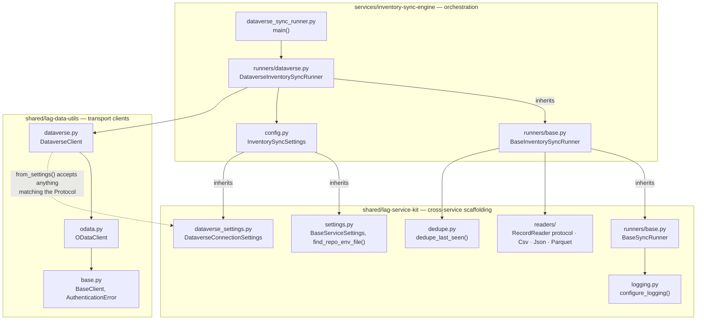
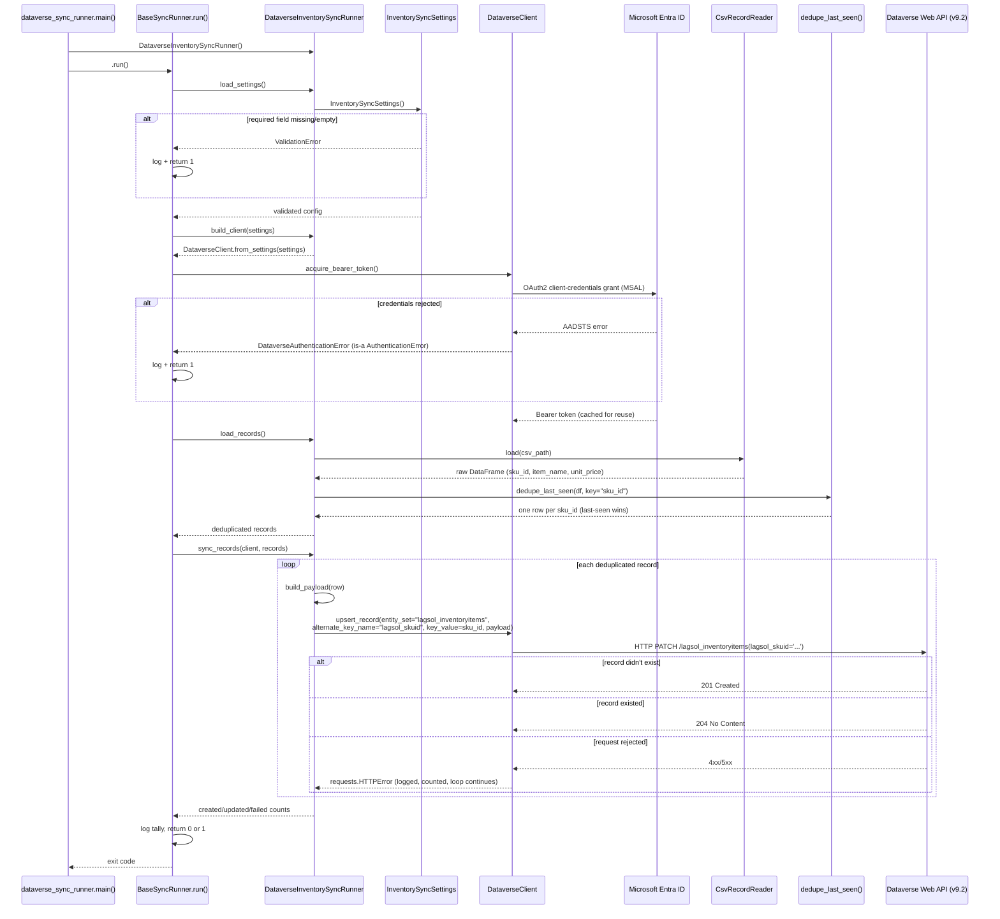

# LAG Dataverse OData Sync Engine

A Python service that migrates ERP inventory data into Microsoft Dataverse
via the OData Web API- built as a reusable foundation for future
Dataverse-backed integrations.

## The business problem

Inventory data lives in an ERP system as a flat, append-only feed. Microsoft
Dataverse — the system of record for downstream Power Platform apps — needs
that data kept in sync.  This sync should be maintained without creating 
duplicate records, without needing manual reconciliation, and without making 
assumptions regarding input format or destination.

This solution  solves three key problems:

1. **Sync inventory records into Dataverse idempotently.** The sync prevents
   record duplication, preventing the creation of duplicate or corrupt records, 
   even when prior runs fail.
2. **Source and Destination Agnostic.** Modular architecture separates the
   service kit from the service- supporting various source and destination
   formats (e.g. CSV, JSON, Parquet) and solutions.
3. **Operable beyond simple execution.** Structured machine-parseable logs, 
   validated configuration, and strict typing make failures diagnosable in 
   production  and support integration with external log solutions
   (e.g. Azure Monitor Log Analytics, Datadog, ELK Stack, etc.)

## Architecture

The repository is split into three layers, supporting separation of concerns.
Each layer holds a single responsibility and one-way dependency on the layer 
below it:



| Layer | Package | Owns | Must never contain |
|---|---|---|---|
| Transport | `shared/lag-data-utils` | HTTP/OData mechanics, MSAL auth, Dataverse-specific headers, the `AuthenticationError` hierarchy | Environment reads, a config framework, business logic |
| Scaffolding | `shared/lag-service-kit` | Settings base classes, structured logging, input-format readers, generic dedup, the destination-agnostic `BaseSyncRunner` orchestration algorithm | Dataverse-specific or inventory-specific knowledge |
| Orchestration | `services/inventory-sync-engine` | The inventory-domain `BaseInventorySyncRunner` (CSV read, dedup, upsert loop) plus one destination leaf class per target system (`DataverseInventorySyncRunner` today) | Anything reusable by a service that isn't this one |

### Why three layers, not two

The obvious split is "library vs. application" — transport code in
`lag-data-utils`, everything else in the service. That's what this repo
started with. It breaks down the moment you imagine a *second* service:
config loading, logging setup, and "read this file format into a
DataFrame" would either get copy-pasted into every new service, or bolted
onto `lag-data-utils` until it stopped being a clean transport layer.

`lag-service-kit` exists to hold exactly the code that is reusable across
*any* future service but isn't a transport concern — and to do that without
making the transport layer depend on a specific configuration framework.
Concretely:

- `lag-data-utils` has zero dependency on Pydantic or any settings library.
  `DataverseClient.from_settings()` is typed against a structural
  `typing.Protocol` (`DataverseConnectionSettings` in `dataverse.py`) —
  any object exposing the right four attributes works, regardless of what
  produced it. Today that's a Pydantic model from `lag-service-kit`;
  tomorrow it could be anything.
- `lag-service-kit` depends on Pydantic and pandas, but knows nothing about
  Dataverse alternate keys or inventory columns — a service that talks to
  a different destination system, or ingests a different kind of record,
  reuses it unchanged.
- The service's destination-specific leaf class is the thinnest layer of
  all. `DataverseInventorySyncRunner` (`runners/dataverse.py`) contributes
  exactly `entity_set`, `alternate_key_field`, `load_settings()`,
  `build_client()`, and `build_payload()` — nothing else — and every other
  behavior (CSV read, dedup, the upsert loop, settings/auth/logging
  orchestration) is inherited unchanged. `dataverse_sync_runner.py` itself
  is reduced to a single line of business logic: which leaf class to
  instantiate and run.

### Layering the sync runner like the transport clients

The transport hierarchy (`BaseClient` → `ODataClient` → `DataverseClient`)
isn't a one-off pattern reserved for connectors — the sync runner is built
the same way, for the same reason: a base class owns the parts of the
algorithm that never vary, and each new variant contributes only what's
genuinely specific to it.

- `lag_service_kit.runners.base.BaseSyncRunner` — the outermost, fully
  generic layer. Knows the *shape* of a sync run (load settings → configure
  logging → authenticate → read records → write records → report results)
  but nothing about inventory, CSVs, or Dataverse. It lives in
  `lag-service-kit`, not the service, because every future service — not
  just this one — needs this same shape.
- `services/inventory-sync-engine/runners/base.py:BaseInventorySyncRunner`
  — the inventory-domain layer. Knows what an inventory record is
  (`sku_id`, `item_name`, `unit_price`), how to read and dedupe the ERP
  CSV feed, and how to drive the generic `upsert_record` loop against
  *any* OData v4 client. Still knows nothing about Dataverse specifically.
- `services/inventory-sync-engine/runners/dataverse.py:DataverseInventorySyncRunner`
  — the destination leaf. The only code in the service that knows
  `lagsol_inventoryitems`, `lagsol_skuid`, and the `lagsol_` field mapping.

Adding a second destination — SAP, Salesforce — means writing a sibling
leaf class (e.g. `runners/sap.py`) that inherits `BaseInventorySyncRunner`
and supplies its own settings, client, entity set, alternate key, and
payload mapping. Neither `BaseSyncRunner` nor `BaseInventorySyncRunner`
changes to support it.

## Key design patterns

### Settings composition via mixins

`InventorySyncSettings` (in `services/inventory-sync-engine/config.py`)
adds no fields of its own — it composes two `lag-service-kit` mixins:

```python
class InventorySyncSettings(DataverseConnectionSettings, BaseServiceSettings):
    model_config = SettingsConfigDict(
        env_file=find_repo_env_file(Path(__file__)),
        ...
    )
```

- `DataverseConnectionSettings` — `azure_tenant_id`, `azure_client_id`,
  `azure_client_secret`, `dataverse_url`, with whitespace- and
  trailing-slash-stripping validators. Any future service that talks to
  Dataverse mixes this in rather than redeclaring the same four fields.
- `BaseServiceSettings` — `log_level`, shared by every service regardless
  of destination system.
- `find_repo_env_file(Path(__file__))` walks upward from the calling
  module looking for a `.env` file, mirroring `python-dotenv`'s discovery
  behavior — a service finds its repo-root `.env` without hardcoding how
  many directories separate it from that root.

Missing or empty required fields raise `pydantic.ValidationError` with a
field-by-field report, caught once in `main()` and logged.

### `from_settings()` and structural typing

`lag-data-utils` needs four string attributes to construct a
`DataverseClient`. Rather than importing a concrete settings class (which
would chain the transport layer to Pydantic) or duplicating a builder
function in every service, `DataverseClient` exposes:

```python
@classmethod
def from_settings(cls, settings: DataverseConnectionSettings) -> "DataverseClient":
    ...
```

where `DataverseConnectionSettings` is a `@runtime_checkable
typing.Protocol` — not a Pydantic base class. Any object with the right
shape satisfies it. This is verified directly: a `lag_service_kit`
settings instance passes `isinstance(obj, Proto)` against the
`lag_data_utils` protocol despite the two packages never importing from
each other.

### `RecordReader` — format-agnostic ingestion

`lag_service_kit.readers` defines one protocol:

```python
class RecordReader(Protocol):
    def load(self, path: Path) -> pd.DataFrame: ...
```

with three implementations shipped today — `CsvRecordReader`,
`JsonRecordReader` (expects `orient="records"` JSON), and
`ParquetRecordReader`. `BaseInventorySyncRunner.load_records()` uses
`CsvRecordReader` because that's what the ERP feed happens to be today;
swapping to JSON or Parquet means overriding `load_records()` in a leaf
class — one method, not a rewrite — and never touches the client, the
settings composition, or the upsert loop in `sync_records()`. Both
methods only ever depend on the resulting `DataFrame`, never on the
source format.

## Execution flow



Re-running the sync is safe by construction: `upsert_record` issues an
`HTTP PATCH` against the `lagsol_skuid` alternate key, which is itself the
idempotency guarantee (OData v4 upsert semantics) — there is no
read-then-decide step that a second run could race against.

## Repository layout

```text
LAG-portfolio/
├── .env                                    # Local secrets — git-ignored, see .env.example
├── platform/
│   └── power-platform/
│       └── LAGInventorySync/                # Configuration-as-Code Dataverse solution manifest
│           └── src/Entities/                 # lagsol_InventoryItem schema, alternate keys
│
├── services/
│   └── inventory-sync-engine/
│       ├── config.py                        # InventorySyncSettings
│       ├── dataverse_sync_runner.py         # Entrypoint — main() instantiates a leaf runner
│       ├── runners/
│       │   ├── base.py                       # BaseInventorySyncRunner — CSV read, dedupe, upsert loop
│       │   └── dataverse.py                  # DataverseInventorySyncRunner — the only Dataverse-specific code
│       ├── generate_mock_data.py            # Mock ERP feed generator (dev/test only)
│       ├── test_connection.py               # Standalone MSAL/Dataverse smoke test
│       ├── requirements.txt
│       └── data/erp_mock_inventory_data_feed.csv
│
└── shared/
    ├── lag-data-utils/                      # Transport clients
    │   └── src/lag_data_utils/clients/
    │       ├── base.py                       # BaseClient, AuthenticationError — auth contract + error root
    │       ├── odata.py                      # ODataClient — generic OData v4 CRUD
    │       └── dataverse.py                  # DataverseClient + from_settings() + Protocol
    │
    └── lag-service-kit/                     # Cross-service scaffolding
        └── src/lag_service_kit/
            ├── settings.py                   # BaseServiceSettings, find_repo_env_file()
            ├── dataverse_settings.py         # DataverseConnectionSettings mixin
            ├── logging.py                    # configure_logging()
            ├── dedupe.py                      # dedupe_last_seen()
            ├── readers/                       # RecordReader, Csv/Json/Parquet
            └── runners/
                └── base.py                    # BaseSyncRunner — destination-agnostic orchestration
```

## Local environment setup

**Prerequisites:** Python 3.11+, a Dataverse environment with an
application user registered for the target Entra ID app.

1. **Create and activate a virtual environment** at the repo root:

   ```bash
   python3 -m venv .venv
   source .venv/bin/activate
   ```

2. **Editable-install both shared packages**, then the service's own
   dependencies:

   ```bash
   pip install -e ./shared/lag-data-utils
   pip install -e ./shared/lag-service-kit
   pip install -r services/inventory-sync-engine/requirements.txt
   ```

   Editable installs mean `from lag_data_utils.clients.dataverse import
   DataverseClient` and `from lag_service_kit.settings import
   BaseServiceSettings` resolve straight to `shared/*/src/`, so edits to
   either shared package take effect immediately, with no reinstall and no
   `sys.path` manipulation.

3. **Configure credentials.** Copy `.env.example` to `.env` at the repo
   root and fill in your Dataverse environment's values:

   ```bash
   cp .env.example .env
   ```

   | Variable | Required | Purpose |
   |---|---|---|
   | `AZURE_TENANT_ID` | Yes | Entra ID tenant GUID |
   | `AZURE_CLIENT_ID` | Yes | Registered app's client ID |
   | `AZURE_CLIENT_SECRET` | Yes | Registered app's client secret |
   | `DATAVERSE_URL` | Yes | Root URL, e.g. `https://org.crm.dynamics.com` |
   | `LOG_LEVEL` | No (default `INFO`) | Root logging level |

   `InventorySyncSettings` finds this file automatically by walking up from
   `config.py`'s own location — run the service from any working
   directory and it still resolves.

4. **Run the sync**:

   ```bash
   cd services/inventory-sync-engine
   python3 dataverse_sync_runner.py
   ```

   A healthy run logs a single structured line and exits `0`:

   ```text
   2026-07-09T10:07:26-0400 | INFO     | lag_service_kit.runners.base | Sync complete: 0 created, 100 updated, 0 failed (of 100 records).
   ```

   Missing configuration, a rejected credential, or a per-record HTTP
   failure all log at `ERROR` and exit `1` — nothing is ever silently
   swallowed.

### Verification

This repository holds itself to a strict bar (see `CLAUDE.md`'s
Architectural Directives): every module under `shared/` and
`services/inventory-sync-engine/` — `config.py`, `dataverse_sync_runner.py`,
and `runners/` — passes both

```bash
mypy --strict --ignore-missing-imports <files>
pydocstyle --convention=numpy <files>
```

with zero findings. Both `lag-data-utils` and `lag-service-kit` ship a
`py.typed` marker (PEP 561) so a consumer running `mypy --strict` against
just a service file — not the whole monorepo at once — still gets full
type information instead of silently degrading to `Any`.

## Project status

Tracked against a phased public-release roadmap in `CLAUDE.md`. As of this
document: dynamic execution and schema verification (Phase 1) and the
production refactor to Pydantic settings, structured logging, NumPy
docstrings, and strict typing (Phase 2) are both complete and verified
end-to-end against the live Dataverse environment.
