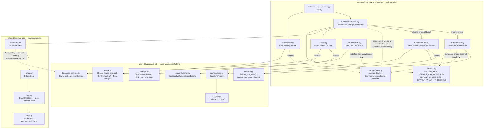
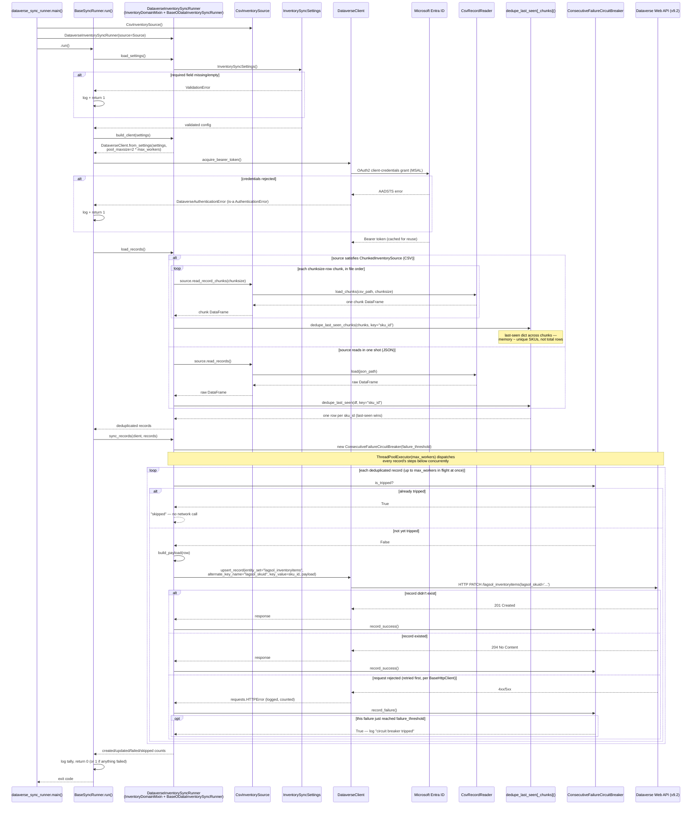

# Linear Analytics Group - Dataverse OData Sync Engine

A Python service that migrates ERP inventory data into Microsoft Dataverse via 
the OData Web API, utilizing an extensible, multi-layer architecture designed 
to readily adopt alternative enterprise destination systems.

## The business problem

Inventory data lives in an ERP system as a flat, append-only feed. Microsoft
Dataverse — the system of record for downstream Power Platform apps — needs
that data kept in sync.  This sync should be maintained without creating 
duplicate records, without needing manual reconciliation, and without making 
format assumptions related to the source or destination.

This solution  solves three key problems:

1. **Sync inventory records into Dataverse idempotently.** The sync prevents
   record duplication, preventing the creation of duplicate or corrupt records, 
   even when prior runs fail.
2. **Source and Destination Agnostic.** Modular architecture separates the
   service kit from the service- supporting various source and destination
   formats (e.g. CSV, JSON, Parquet) and solutions.
3. **Operable beyond simple execution.** Structured machine-parseable logs, 
   validated configuration, and strict typing make failures diagnosable in 
   production and support integration with external log solutions
   (e.g. Azure Monitor Log Analytics, Datadog, ELK Stack, etc.)

## Architecture

The repository is split into three layers, supporting separation of concerns.
Each layer holds a single responsibility and one-way dependency on the layer 
below it:



| Layer | Package | Owns | Must never contain |
|---|---|---|---|
| Transport | `shared/lag-data-utils` | HTTP mechanics (`BaseHttpClient` — pooling, timeout, retry-with-backoff), OData v4 CRUD (`ODataClient`), MSAL auth, Dataverse-specific headers, the `AuthenticationError` hierarchy | Environment reads, a config framework, business logic |
| Scaffolding | `shared/lag-service-kit` | Settings base classes, structured logging, input-format readers (including chunked CSV reading), generic dedup (whole-DataFrame and chunked), a generic `ConsecutiveFailureCircuitBreaker`, the source- and destination-agnostic `BaseSyncRunner` orchestration algorithm (generic over the transport client type) | Dataverse-specific, inventory-specific, or source-format-specific knowledge; any baked-in default number tuned to one service (see `defaults.py`) |
| Orchestration | `services/inventory-sync-engine` | Three independent things that combine, never duplicate: the domain mixin `InventoryDomainMixin` (dedup, source binding), one write-protocol base per wire protocol (`BaseODataInventorySyncRunner` today — concurrent upsert loop, circuit breaker), and one destination leaf class per target system (`DataverseInventorySyncRunner`, combining exactly one of each) — plus, on a wholly separate axis, one `InventorySource` per feed format (`CsvInventorySource`, the only one that also satisfies the optional `ChunkedInventorySource` capability, and `JsonInventorySource`), composed into a runner by the caller. `defaults.py` holds every constructor default tuned to this service specifically | Anything reusable by a service that isn't this one |

Three axes vary independently here, and each stays a single point of
definition:

- **Source format** (`sources/`) — composed into a runner at
  construction time, never inherited.
- **Write protocol** (`runners/odata.py`, and future siblings) — a base
  class per protocol, combined into a leaf via multiple inheritance.
- **Destination system** (`runners/dataverse.py`, and future siblings) —
  the leaf class itself, combining one domain mixin with one protocol
  base.

A runner is *given* a source object; it never subclasses one. A
destination leaf *combines with* a protocol base via multiple
inheritance, rather than reimplementing the write loop. The
write loop and the domain/dedup logic are both class-level, structural
concerns fixed for the lifetime of that leaf class — unlike the source,
which is a per-run operational choice.

### Three Layered Approach

A typical split calls for "library vs. application" — transport code in
`lag-data-utils`, everything else in the service. That approach fails to
support additional services (e.g., config loading, logging setup, and 
the source file DataFrame conversion used to support record deduplication). 
Under a traditional split, each new service would result in duplicated code 
or a bloated transport layer- compromising the clean boundaries of 
`lag-data-utils` and preventing delivery of a clean and maintainable 
transport layer.

`lag-service-kit` exists to hold code and logic that is reusable across
*any* future service, independent of any transport concern. This approach 
prevents transport layer dependency on any specific configuration framework. 

Concretely:

- `lag-data-utils` has zero dependency on Pydantic or any settings library.
  `DataverseClient.from_settings()` is typed against a structural
  `typing.Protocol` (`DataverseConnectionSettings` in `dataverse.py`) —
  any object exposing the right four attributes works, regardless of what
  produced it.
- `lag-service-kit` depends on Pydantic and pandas, but knows nothing about
  Dataverse alternate keys or inventory columns — any service that talks to
  a different destination system or ingests a different kind of record can
  leverage this kit out of the box.
- The service's destination-specific leaf class is the thinnest layer - housing 
  specific implementations for the destination system. 
    - `DataverseInventorySyncRunner` (`runners/dataverse.py`) contributes 
    only methods specific to Microsoft Dataverse integrations: `entity_set`,
    `alternate_key_field`, `load_settings()`, `build_client()`, and
    `build_payload()`.
    - It does **not** inherit its source feed. The feed format a run reads
    is set at construction time (e.g. 
    `DataverseInventorySyncRunner(source=CsvInventorySource())`) in 
    `dataverse_sync_runner.py` — via any object satisfying the
    `sources.InventorySource` protocol (`sources/base.py`). A destination
    inheriting from a source class would fix that destination to one feed
    format forever; composition lets the same `DataverseInventorySyncRunner`
    read CSV or JSON — both ship today, see `sources/csv.py` and
    `sources/json.py` — with no new class.
    - It **does** inherit two independent bases, combined via multiple
    inheritance: `InventoryDomainMixin` (`runners/base.py` — dedup, source
    binding) and `BaseODataInventorySyncRunner` (`runners/odata.py` — the
    OData v4 upsert loop). Neither base depends on or duplicates the
    other; a class combining both gets dedup, source binding, and the
    write loop with each defined in exactly one place.
    - `dataverse_sync_runner.py` is reduced to implementation-specific business
    logic - identifying the leaf class to instantiate, which source to pair
    it with, and running it.

### Layering Patterns

The transport hierarchy (`BaseClient` → `ODataClient` → `DataverseClient`)
goes beyond simply being reserved for connectors. Services like the sync runner 
are built the same way, for the axis that genuinely is a hierarchy.
  - A base class owns core implementation pieces that are vital to any
  integration and rarely vary.
  - Each concrete class inheriting from the base class and other mid-layer
  abstractions contributes methods and state specific to the subject
  implementation.

Not every axis of variation is a hierarchy, though. Where two axes vary
*independently* — as source format and destination system do here —
forcing them into one inheritance chain produces either a combinatorial
explosion of classes (`CsvDataverseRunner`, `JsonDataverseRunner`,
`CsvSapRunner`, `JsonSapRunner`, ...) or an arbitrary, incorrect coupling
(a destination that can only ever read one feed format). The sync runner
therefore uses inheritance for the destination axis and composition for
the source axis.

#### Our Example: LAG Service Kit

The Service Kit combines three techniques, one per axis of variation:
dependency injection for the source (an operational, per-run choice),
mixin composition for domain logic and write protocol (two class-level
concerns that must each stay defined exactly once), and template methods
for the parts every run requires regardless of axis.

- `lag_service_kit.runners.base.BaseSyncRunner` — the outermost, fully
  generic layer. Knows the *shape* of a sync run (core execution flow: 
  load settings → configure logging → authenticate → read records → 
  write records → report results) but makes no direct implementation or 
  reference to the shape or type of the source or destination. 
  It lives in the kit in lieu of any particular service
  to support other service implementations that require this same shape.
  It is generic over `ClientT` (bound to `lag_data_utils.clients.base.BaseClient`),
  so every subclass in a given hierarchy agrees on one concrete client
  type for `build_client()` and `sync_records()`, rather than each
  narrowing it independently.
- `services/inventory-sync-engine/runners/base.py:InventoryDomainMixin`
  — the inventory-domain layer. Knows what an inventory record is
  (e.g., `sku_id`, `item_name`, `unit_price`) and how to dedupe it. Knows
  nothing about the source feed, wire protocol, or destination. 
  Its constructor takes a `source: InventorySource` collaborator, 
  while `load_records()` calls `self.source.read_records()`. 
  It does not inherit `BaseSyncRunner` and commits to no `ClientT`. 
  It is a bare mixin combined into a leaf class via multiple inheritance 
  alongside the leaf's required protocol.
- `services/inventory-sync-engine/runners/odata.py:BaseODataInventorySyncRunner`
  — the write-protocol layer, `BaseSyncRunner[ODataClient]`. Knows how to
  drive the generic `upsert_record` loop against *any* OData v4 client,
  given `entity_set`, `alternate_key_field`, and `build_payload()` from
  a destination leaf. Knows nothing about dedup or source feeds — those
  come from whichever domain mixin the leaf inherits. `dedupe_key`
  is declared here (for the one line in `sync_records()` that needs a
  record's business-key column) but never assigned here — a domain mixin
  is the only place that value is set, so it is never duplicated.
  `sync_records()` dispatches up to `max_workers` upserts concurrently
  via `ThreadPoolExecutor`, and builds one
  `lag_service_kit.circuit_breaker.ConsecutiveFailureCircuitBreaker`
  per run to stop dispatching further requests after
  `failure_threshold` consecutive failures — both are protocol-level
  concerns, not domain or destination knowledge, so they live here too.
- `services/inventory-sync-engine/sources/base.py:InventorySource` — a
  `typing.Protocol`, not a base class. Fixes only the shape
  (`read_records() -> pd.DataFrame`) that any source must expose. A
  sibling protocol in the same module, `ChunkedInventorySource`, adds an
  optional `read_record_chunks()` capability that only a source able to
  genuinely stream in bounded memory need implement — `CsvInventorySource`
  does; `JsonInventorySource` does not, and simply isn't checked via
  `isinstance` against it.
- `services/inventory-sync-engine/sources/csv.py:CsvInventorySource` —
  the source-format implementation. The only code in the service that
  knows how to read the ERP CSV feed. Knows nothing about
  `InventoryDomainMixin`, Dataverse, or any destination — it isn't even
  in the `runners` package.
- `services/inventory-sync-engine/runners/dataverse.py:DataverseInventorySyncRunner`
  — the destination leaf: `class DataverseInventorySyncRunner(InventoryDomainMixin, BaseODataInventorySyncRunner)`.
  The only code in the service that knows `lagsol_inventoryitems`,
  `lagsol_skuid`, and the `lagsol_` field mapping. It has no relationship
  to `CsvInventorySource` in its class definition at all.
- `services/inventory-sync-engine/dataverse_sync_runner.py:main()` — the
  one place that pairs a destination with a source for a given run:
  `DataverseInventorySyncRunner(source=CsvInventorySource())`.

Adding a second destination that also speaks OData v4 — SAP S/4HANA
Cloud, SharePoint Online — means writing a sibling leaf class (e.g.
`runners/sap.py`) combining the same two bases,
`class SapInventorySyncRunner(InventoryDomainMixin, BaseODataInventorySyncRunner)`,
and supplying its own settings, client, entity set, alternate key,
and payload mapping. Its entrypoint composes it with whichever source it
needs. Adding a destination that speaks a genuinely different wire
protocol (e.g., SOAP, a bulk-upload REST API, etc.) means writing a sibling
protocol base (e.g. `runners/soap.py:BaseSoapInventorySyncRunner(BaseSyncRunner[SoapClient])`)
with its own hooks and write loop. Its leaf class still inherits
`InventoryDomainMixin` unchanged, so dedup and source binding are never
reimplemented for a new protocol. A second source format is a sibling
source class implementing only `read_records()` — `sources/json.py:JsonInventorySource`
ships today alongside `CsvInventorySource`; a Parquet drop would be the
same shape again. `DataverseInventorySyncRunner(source=JsonInventorySource())`
reads the JSON mock feed and produces byte-for-byte identical
deduplicated records to `DataverseInventorySyncRunner(source=CsvInventorySource())`
against the same mock dataset, with no new subclass. Neither
`BaseSyncRunner`, `InventoryDomainMixin`, nor any protocol base changes
to support a new instance of any axis, and the three axes never multiply
against each other, thus preventing combinatorial explosion.

## Key design patterns

### Settings composition via mixins

`InventorySyncSettings` (in `services/inventory-sync-engine/config.py`)
adds no fields of its own — it composes two `lag-service-kit` mixins:

```python
class InventorySyncSettings(DataverseConnectionSettings, BaseServiceSettings):
    model_config = SettingsConfigDict(
        env_file=find_repo_env_file(Path(__file__)),
        ...
    )
```

- `DataverseConnectionSettings` — `azure_tenant_id`, `azure_client_id`,
  `azure_client_secret`, `dataverse_url`, with whitespace- and
  trailing-slash-stripping validators. Any future service that talks to
  Dataverse mixes this in rather than redeclaring the same four fields.
- `BaseServiceSettings` — `log_level`, shared by every service regardless
  of destination system.
- `find_repo_env_file(Path(__file__))` walks upward from the calling
  module looking for a `.env` file, mirroring `python-dotenv`'s discovery
  behavior — a service finds its repo-root `.env` without hardcoding how
  many directories separate it from that root.

Missing or empty required fields raise `pydantic.ValidationError` with a
field-by-field report, caught once in `BaseSyncRunner.run()` (not by the
service's own `main()`, which has no error handling of its own) and
logged.

### `from_settings()` and structural typing

`lag-data-utils` needs four string attributes to construct a
`DataverseClient`. Rather than importing a concrete settings class (which
would chain the transport layer to Pydantic) or duplicating a builder
function in every service, `DataverseClient` exposes:

```python
@classmethod
def from_settings(cls, settings: DataverseConnectionSettings) -> "DataverseClient":
    ...
```

where `DataverseConnectionSettings` is a `@runtime_checkable
typing.Protocol` — not a Pydantic base class. Any object with the right
shape satisfies it. This is verified directly: a `lag_service_kit`
settings instance passes `isinstance(obj, Proto)` against the
`lag_data_utils` protocol despite the two packages never importing from
each other.

### `RecordReader` and `InventorySource` — format-agnostic ingestion

Two protocols cooperate here, at two different layers:

```python
# lag_service_kit.readers — generic: any file format into a DataFrame
class RecordReader(Protocol):
    def load(self, path: Path) -> pd.DataFrame: ...

# services/inventory-sync-engine/sources — domain-scoped: a runner's source
class InventorySource(Protocol):
    def read_records(self) -> pd.DataFrame: ...
```

`lag_service_kit.readers` ships three `RecordReader` implementations —
`CsvRecordReader`, `JsonRecordReader` (expects `orient="records"` JSON),
and `ParquetRecordReader` — generic across any service. The inventory
service ships two sources today, each wrapping one reader with the one
thing it adds — knowing *which* file: `sources/csv.py:CsvInventorySource`
wraps `CsvRecordReader` over `data/erp_mock_inventory_data_feed.csv`, and
`sources/json.py:JsonInventorySource` wraps `JsonRecordReader` over
`data/erp_mock_inventory_data_feed.json` — the same mock inventory
dataset, shipped in both formats. Both `read_records()` implementations
satisfy `InventorySource` identically.

Crucially, `InventoryDomainMixin` depends on `InventorySource`, not 
any concrete source class, and receives one through its constructor
rather than through inheritance:

```python
class InventoryDomainMixin:
    def __init__(self, source: InventorySource) -> None:
        self.source = source

    def load_records(self) -> pd.DataFrame:
        return dedupe_last_seen(self.source.read_records(), key=self.dedupe_key)
```

(Simplified for this point: the real `load_records()` first checks
whether `source` also satisfies the optional `ChunkedInventorySource`
capability — see "Runtime Checkable Protocols" below — and reads/dedupes
in bounded-memory chunks when it does, falling back to the single-shot
call shown here otherwise.)

Supporting a further format (Parquet, a REST feed) means adding one more
sibling module implementing only `read_records()` with the matching
`RecordReader`. No runner changes, because no runner inherits from a
source: `DataverseInventorySyncRunner(source=JsonInventorySource())`
reads JSON with the exact same class used for CSV — proven directly,
not just claimed: run against the two mock feeds, both sources produce \
identical deduplicated records.
`InventoryDomainMixin.load_records()` (dedup) and
`BaseODataInventorySyncRunner.sync_records()` (the upsert loop) never
change either way — both only ever depend on the resulting `DataFrame`,
never the source that produced it.

### Constructor Injection vs. Environment Bloat

During the design of the deduplication pipeline, we weighed two
approaches for handling variable business keys (e.g., `sku_id`):
driving the key dynamically via `.env` (e.g., `DEDUPE_KEY=item_sku`)
vs. injecting the dependency/key via Python constructors.

We chose **Constructor Injection** at the service layer for three
critical enterprise reasons — a decision that has since generalized
beyond `dedupe_key` to every tunable in `defaults.py`
(`DEFAULT_MAX_WORKERS`, `DEFAULT_CHUNK_SIZE`,
`DEFAULT_FAILURE_THRESHOLD`), each overridable the same way and never
read from the environment:

1. **Separation of Concerns (Domain vs. Environment):** Environmental
   variables (`.env`) should govern deployment-specific secrets,
   endpoints, and log levels. A deduplication key is a fundamental
   business domain rule bound to the database schema — and a
   concurrency limit, chunk size, or failure threshold is an
   operational tuning decision a code reviewer should see change in a
   diff, not one silently flipped in a deployment's environment.
   Exposing either kind to `.env` would allow operational environments
   to change core sync behavior without a formal code review or
   deployment pipeline.
2. **Preventing Framework Pollution:** Forcing the generic
   `BaseSyncRunner` in the scaffolding kit to store and expose
   stateful configurations violates the Dependency Inversion
   Principle. By keeping our scaffolding stateless and injecting
   dependencies through the service constructors, we keep our core
   orchestration engine incredibly lightweight and testable.
3. **Flawless Unit Testing:** Constructor injection guarantees that we
   can instantiate the sync runners in a local test suite and inject
   mock schemas, mock configurations, and lightweight in-memory
   DataFrames instantly, without mocking global environment variables
   or loading `.env` files.

### Secrets Management: Azure Key Vault vs. Plain `.env`

`AZURE_CLIENT_SECRET` — the Entra ID app registration's credential —
originally lived only in a plaintext, git-ignored `.env` file. That's
adequate for a solo developer's local machine, but not for a service
meant to demonstrate enterprise-grade secrets handling: a plaintext
file is one accidental `git add -f`, shared support ticket, or backup
away from leaking a live credential.

**Two separate identities are in play here, easy to conflate:** the
Entra ID app registration (service principal) that authenticates *to
Dataverse* via MSAL, versus whatever identity is allowed to *read the
secret out of Key Vault* in the first place — your own Azure AD user
locally (`az login`), or a Managed Identity if this ever ran inside
Azure. `azure.identity.DefaultAzureCredential` resolves the second
one transparently, trying a chain of credential sources in order, so
the exact same code path handles both without branching on where it's
running.

**The mechanism:**
`lag_service_kit.azure_key_vault.AzureKeyVaultSettingsSource` is a
`pydantic_settings.PydanticBaseSettingsSource` — the same extension
point `BaseSettings` already uses internally for environment variables
and `.env` — added via
`BaseServiceSettings.settings_customise_sources()` only when
`AZURE_KEY_VAULT_URL` is actually set as a real environment variable
(checked via `env_settings()`, not a raw `os.environ` read, so it
reuses this class's own case-sensitivity/encoding configuration
instead of duplicating it). Priority, highest wins: a real environment
variable, then Key Vault, then `.env`. Unconfigured, Key Vault is
absent from the resolution chain entirely — not merely empty — so it
costs nothing and changes nothing for a deployment that never sets
`AZURE_KEY_VAULT_URL`. This is an optional upgrade, not a requirement;
the `.env`-only path stays fully supported for local dev without Azure
access at all.

**All four Dataverse connection values are vault-backed, not just the
client secret** — declared via `vault_secret_fields` on
`DataverseConnectionSettings`. The tenant ID, client ID, and Dataverse
URL aren't credentials on their own, but in a *public* repository they
are real reconnaissance value: together they identify exactly which
Entra ID tenant and live Dataverse environment this points to, a
specific target for phishing or consent-phishing against this exact
app registration, even though none of the three would authenticate
anything by itself.

**Provisioning is infrastructure-as-code**, not a manual portal
click-through — see `infra/azure/key-vault/` for the scripts that
create the vault (RBAC-authorized, not the legacy access-policy
model), grant the minimum role needed, and push values in. Every
example in that directory uses placeholder names; no real resource
names or subscription identifiers appear in this repository.

### Field Mapping: Constructor-Injected Dict vs. External Mapping File

Typically, enterprise-integration field mapping is achieved through a
**metadata-driven, declarative mapping specification** — a YAML/JSON
mapping document (or a mapping-UI that generates one), loaded and
applied by a generic mapper at runtime. This approach lets
non-engineers audit mappings, supports several customers' mappings off
one deployed codebase, and enables tooling (schema-drift detection,
mapping editors) that's impossible once a mapping is buried in a
method body.

We deliberately did **not** build that here:

* **Scope Mismatch:** A full external mapping-file loader solves a
  multi-tenant problem. This portfolio has one destination and a
  three-column schema — building a generic mapping-config engine for
  that would be premature abstraction with no current payoff.
* **Consistency With an Existing, Documented Decision:** This codebase
  already chose Constructor Injection over `.env`-driven configuration
  specifically so schema-affecting changes go through code review and a
  deployment pipeline (see "Constructor Injection vs. Environment
  Bloat" above). A live-editable external mapping file without code review
  requires safeguards beyond this project's current scope designed to
  prevent inadvertent or silent data corruption in the destination system.
* **Preventing the use of Data as Code:**
  When data is set in code *as an unstructured method body* rather than as
  *data*, it's opaque to review, impossible to reuse generically,
  and requires a full method override to change it.

**Constructor Injection:** `build_payload()` applies a
constructor-injected `field_mapping: Dict[str, str]` (source column ->
Dataverse field, defaulting to `DEFAULT_FIELD_MAPPING`) generically,
via one dict comprehension. This approach stands up the mapping as
data supplied at construction time, providing the flexibility needed
to support varied Dataverse entities while the mapping itself still
ships in code and goes through the same PR review as other schema
changes.

Scalability to support simultaneous mappings from a single deployment
may require a shift to declarative-file configuration, provided that
framework provides the necessary guardrails to prevent data corruption.

### Monorepo Dependency Resolution: Install Order vs. a Private Feed

`lag-service-kit`'s `pyproject.toml` declares `lag-data-utils>=1.0.0`
in exactly the same form as any PyPI dependency (`pydantic>=2.7.0`,
`pandas>=2.2.0`). There is no `pyproject.toml` syntax that marks one
dependency as "resolve this from a local path" and another as
"resolve this from a package index" — pip has no such distinction
built in.

**How this actually resolves today:** purely by install order, not by
anything declared in the metadata. Every documented workflow in this
repo — the local setup steps below, and CI's explicit `lag-data-utils`
wheel build before `lag-service-kit`'s — installs `lag-data-utils`
first, so by the time pip is asked to satisfy `lag-data-utils>=1.0.0`,
it is already present in the environment and pip never looks anywhere
else for it. Reverse that order, in an environment with no local
`lag-data-utils` already present, and this fails outright —
`lag-data-utils` isn't actually published anywhere pip reaches by
default.

**The enterprise-grade fix, and why it's not here:** the robust answer
is a private package index — an internal Azure Artifacts feed, or a
self-hosted PyPI-compatible server — that actually publishes
`lag-data-utils`, so it resolves like any other dependency regardless
of install order. (A monorepo-aware tool with native workspace/path
dependencies, like `uv` or PDM, is the other real fix, at the cost of
a bigger toolchain change.) Standing up either is out of scope here:
one internal package, consumed by exactly one sibling package, in a
repo with two documented install paths — local dev and CI — that both
already get the order right. This note exists to make that a
documented, understood tradeoff rather than a silent gap — the
trigger to revisit it is a second internal consumer, a third install
path, or any of this actually being published externally.

### Multi-Threaded Concurrency vs. OData v4 $batch

To scale the execution speed of the sync engine beyond sequential, 
record-by-record writes, we analyzed two standard architectural patterns for 
accelerating I/O-bound REST workloads: OData v4 `$batch` processing and 
client-side multi-threading.

We deliberately chose a **multi-threaded concurrency pool** over `$batch` 
operations. This approach achieves maximum performance gains while preserving 
our core domain safety guarantees and keeping the transport layer lightweight.

#### The $batch Evaluation & The Changeset Trap

OData v4 defines a `$batch` endpoint where multiple operations are packed into a 
single `multipart/mixed` HTTP POST request. While this reduces TCP/TLS 
connection handshake overhead from $N$ to roughly $N/1000$ (matching the 
Dataverse batch limit), it introduces notable operational trade-offs:
* **The Atomic Rollback Conflict:** OData batching supports *Changesets*—where 
all operations in the group are treated as a single atomic transaction. If a 
single payload in a batch of 1,000 fails validation, the entire batch rolls 
back. This directly violates our primary acceptance criterion- that one failed 
record must never corrupt or roll back successful writes for adjacent, 
unrelated records.
* **The Standalone Parsing Overhead:** Bypassing the rollback trap requires 
configuring each batch operation as an independent, non-changeset execution 
block. However, Python’s `requests` library lacks built-in OData batch 
parser mechanisms. Implementing this would require writing, testing, and 
maintaining a custom parser to build, serialize, and deserialize complex 
multipart MIME streams inside the `ODataClient` class, dramatically increasing 
the risk of transport-layer regression.
* **API Rate-Limit Parity:** Contrary to common assumptions, Microsoft 
Dataverse service protection and daily entitlement quotas count individual 
operations *inside* a batch request against your user allocations. While 
`$batch` reduces network round-trip latency, it does not bypass the rate-limit 
throttling bounds, yet introduces massive client-side overhead to parse and 
manage.

#### The Winning Solution: Client-Side Multi-Threading

Instead of grouping requests on the server, we implemented a controlled thread 
execution pool using a thread-safe connection session manager. This choice 
unlocked several key advantages:

* **Granular Isolation & Fault Tolerance:** Each API write is processed on its 
own thread- a failed record is caught, logged, and isolated instantly. 
The sync engine continues executing the rest of the queue unimpeded.
* **Native Connection Pooling:** By pairing multi-threading with a thread-safe 
connection adapter, we reuse TCP handshakes at the transport layer, achieving 
nearly identical latency optimization to batching without the structural 
complexity of MIME parsing.
* **Dynamic Concurrency Throttling:** Client-side concurrency allows us to 
easily listen to Dataverse's `Retry-After` HTTP headers. If we hit service 
protection limits, we can dynamically back off or queue-throttle specific 
worker threads rather than stalling an entire 1,000-record batch.

### Runtime Checkable Protocols

We use a `@runtime_checkable` Protocol (`ChunkedInventorySource`, in
`sources/base.py`) to dynamically detect whether an incoming data
source supports chunked streaming.

* **Interface Segregation & LSP:** Not all source formats can genuinely stream. 
Forcing a dummy streaming method onto every reader violates the Liskov 
Substitution Principle and the Interface Segregation Principle. A separate 
Protocol segregates this optional capability cleanly- abstaining from forcing
clients into implementing methods they cannot support.
* **Type-Safe Narrowing:** It allows Mypy to narrow types inside conditional 
blocks. This eliminates the need for unsafe `ignore` workarounds that may hide
true defects.
* **CPU vs. I/O Bottlenecks:** While structural `isinstance` checks carry a 
minor runtime CPU overhead, this check occurs exactly once at the start of the 
sync run—not inside the inner loop processing thousands of records. In a 
network-heavy, I/O-bound pipeline, a microsecond-level CPU check is 
mathematically irrelevant compared to milliseconds of network latency, adding
little-to-no cost to implementing this clean and predictable design.

### Circuit Breaker vs. Unconditional Retry Exhaustion

`BaseHttpClient`'s retry policy already absorbs transient failures
(429/502/503/504) on a *single* request. It has no opinion on the
*batch* as a whole — a systemic outage (Dataverse down, credentials
revoked mid-run) looks identical to `sync_records()` as a string of
isolated per-record failures, and without a higher-level check, every
remaining record in the batch is still dispatched against an
already-failing destination.

* **Consecutive, not Rate-Based:** `ConsecutiveFailureCircuitBreaker`
  trips after N failures in a row, not a percentage of a sliding
  window. Simpler to reason about, and sufficient for what it needs to
  detect — a sustained, one-sided outage — without the added
  complexity of a windowed rate calculation.
* **Skip, Don't Cancel:** Once tripped, a worker thread checks
  `is_tripped` *before* issuing its request, not after. An
  already-in-flight request (there can be up to `max_workers` of them)
  is not interrupted — cancelling a request mid-flight risks an
  ambiguous outcome (did the PATCH apply or not?) that a clean skip
  avoids entirely.
* **No Resume State, By Design:** A tripped run reports its skipped
  count and exits non-zero; it does not persist which records were
  skipped for a later resume. Every write is an idempotent alternate-
  key upsert (see Architectural Directive 2), so re-running the whole
  batch after the outage is fixed reproduces the correct end state at
  no extra cost — a resume mechanism would be complexity solving a
  problem idempotency already solves.
* **Layered at `lag_service_kit`, Not the Runner:** The breaker itself
  knows nothing about HTTP, OData, or Dataverse — it only sees a
  stream of success/failure outcomes. It lives in the cross-service
  scaffolding layer alongside `dedupe_last_seen_chunks`, reusable by
  any future destination's write loop, while the *threshold value* is
  a service-level tuning decision (`defaults.DEFAULT_FAILURE_THRESHOLD`),
  matching how `DEFAULT_CHUNK_SIZE` is handled.

> **Assumption this design depends on:** the "no resume state" argument
> above holds only because every write in this portfolio is an
> idempotent alternate-key `PATCH` (Architectural Directive 2). A
> future destination or protocol that *cannot* guarantee idempotent
> writes (e.g. a plain `POST`-only create endpoint, or a bulk-load API
> without an upsert primitive) would need the breaker paired with a
> real resume/checkpoint mechanism — tracking exactly which records
> were skipped, not just a count — before re-running the batch would be
> safe. That case isn't addressed here and isn't in scope for this
> portfolio at this time; it would need to be designed for explicitly
> if a non-idempotent destination is ever added.

## Execution flow



Re-running the sync is safe by construction: `upsert_record` issues an
`HTTP PATCH` against the `lagsol_skuid` alternate key, which is itself the
idempotency guarantee (OData v4 upsert semantics) — there is no
read-then-decide step that a second run could race against.

## Repository layout

```text
LAG-portfolio/
├── .env                                    # Local secrets — git-ignored, see .env.example
├── .env.example                            # Template for the 5 variables config.py reads
├── pyproject.toml                          # [tool.mypy], [tool.pytest.ini_options], and the [project]/
│                                            # [project.optional-dependencies] "dev"/"test" extras — this
│                                            # repo's own dev/test tooling, never published (see below)
├── platform/
│   └── power-platform/
│       └── LAGInventorySync/                # Configuration-as-Code Dataverse solution manifest
│           └── src/Entities/                 # lagsol_InventoryItem schema, alternate keys
│
├── services/
│   └── inventory-sync-engine/
│       ├── config.py                        # InventorySyncSettings
│       ├── dataverse_sync_runner.py         # Entrypoint — main() instantiates a leaf runner
│       ├── defaults.py                      # DEDUPE_KEY, DEFAULT_MAX_WORKERS, DEFAULT_CHUNK_SIZE,
│       │                                    # DEFAULT_FAILURE_THRESHOLD — this service's tuned numbers
│       ├── runners/                          # Domain + protocol axes — mixin composition (multiple inheritance)
│       │   ├── __init__.py                   # Exports InventoryDomainMixin, BaseODataInventorySyncRunner
│       │   ├── base.py                       # InventoryDomainMixin — dedupe, composes a source (no client type)
│       │   ├── odata.py                      # BaseODataInventorySyncRunner — concurrent upsert loop + breaker
│       │   └── dataverse.py                  # DataverseInventorySyncRunner — the only Dataverse-specific code
│       ├── sources/                          # Source axis — composed into a runner, never inherited
│       │   ├── __init__.py                   # Exports InventorySource, ChunkedInventorySource, Csv/Json sources
│       │   ├── base.py                       # InventorySource + ChunkedInventorySource protocols
│       │   ├── csv.py                        # CsvInventorySource — the only source that streams in chunks
│       │   └── json.py                       # JsonInventorySource — the only JSON-specific code
│       ├── requirements.txt
│       ├── generate_mock_data.py            # Dev/test mock feed generator — git-ignored, excluded from mypy
│       ├── test_connection.py               # MSAL/Dataverse connectivity smoke test — also git-ignored
│       └── data/
│           ├── erp_mock_inventory_data_feed.csv
│           └── erp_mock_inventory_data_feed.json
│
├── shared/
│   ├── lag-data-utils/                     # Transport clients
│   │   └── src/lag_data_utils/clients/
│   │       ├── base.py                      # BaseClient, AuthenticationError — auth contract + error root
│   │       ├── http.py                      # BaseHttpClient — pooled session, timeout, retry-with-backoff
│   │       ├── odata.py                     # ODataClient — generic OData v4 CRUD
│   │       └── dataverse.py                 # DataverseClient + from_settings() + Protocol
│   │
│   └── lag-service-kit/                    # Cross-service scaffolding
│       └── src/lag_service_kit/
│           ├── settings.py                  # BaseServiceSettings, find_repo_env_file()
│           ├── dataverse_settings.py        # DataverseConnectionSettings mixin
│           ├── logging.py                   # configure_logging()
│           ├── dedupe.py                     # dedupe_last_seen(), dedupe_last_seen_chunks()
│           ├── circuit_breaker.py            # ConsecutiveFailureCircuitBreaker — any batch write loop
│           ├── readers/                      # RecordReader, Csv (+ chunked)/Json/Parquet
│           └── runners/
│               ├── __init__.py               # Exports BaseSyncRunner
│               └── base.py                   # BaseSyncRunner[ClientT] — destination-agnostic orchestration
│
└── tests/                                   # Centralized suite, layered to mirror the source tree
    ├── conftest.py                           # Shared fixtures — fake Entra ID/Dataverse, no real network
    ├── unit/
    │   ├── lag_data_utils/                   # BaseClient, BaseHttpClient, ODataClient, DataverseClient
    │   ├── lag_service_kit/                  # settings, dedupe, logging, readers, circuit breaker, BaseSyncRunner
    │   └── inventory_sync_engine/            # InventoryDomainMixin, BaseODataInventorySyncRunner,
    │                                          # DataverseInventorySyncRunner, CsvInventorySource
    ├── integration/                          # Real classes across a mocked network boundary
    └── acceptance/                           # Black-box: idempotency, operability, source/dest agnosticism,
                                                # circuit breaker — one business requirement each
```

## Local environment setup

**Prerequisites:** Python 3.9+, a Dataverse environment with an
application user registered for the target Entra ID app.

1. **Create and activate a virtual environment** at the repo root:

   ```bash
   python3 -m venv .venv
   source .venv/bin/activate
   ```

2. **Editable-install both shared packages**, then the service's own
   dependencies:

   ```bash
   pip install -e ./shared/lag-data-utils
   pip install -e ./shared/lag-service-kit
   pip install -r services/inventory-sync-engine/requirements.txt
   ```

   Editable installs mean `from lag_data_utils.clients.dataverse import
   DataverseClient` and `from lag_service_kit.settings import
   BaseServiceSettings` resolve straight to `shared/*/src/`, so edits to
   either shared package take effect immediately, with no reinstall and no
   `sys.path` manipulation.

   Running the test suite or the Verification section's checks below
   needs the root `pyproject.toml`'s optional dependency groups — these
   are not needed when simply running the service itself. The root
   project has no
   module content of its own — there's nothing to iterate on, so
   unlike the two shared packages above, a plain (non-editable) install
   is all this needs; this exists only to resolve the `dev`/`test`
   extras:

   ```bash
   pip install ".[dev,test]"   # pytest, responses, mypy, pydocstyle, coverage
   ```

   CI (`.github/workflows/ci.yml`) deliberately does **not** use
   editable installs for the two shared packages either — it builds a
   real wheel for each (`python -m build --wheel`) and installs that,
   so CI validates the actual artifact a release would ship, not a
   source-tree reference that can hide packaging bugs (e.g., a
   `[tool.hatch.build]` misconfiguration silently excluding a file from
   the real wheel). Editable installs remain the right choice here, in
   local dev, specifically because the goal is different: fast
   iteration on shared-package code, not artifact validation.

3. **Configure credentials.** Copy `.env.example` to `.env` at the repo
   root and fill in your Dataverse environment's values:

   ```bash
   cp .env.example .env
   ```

   | Variable | Required | Purpose |
   |---|---|---|
   | `AZURE_TENANT_ID` | Yes | Entra ID tenant GUID |
   | `AZURE_CLIENT_ID` | Yes | Registered app's client ID |
   | `AZURE_CLIENT_SECRET` | Yes | Registered app's client secret |
   | `DATAVERSE_URL` | Yes | Root URL, e.g. `https://org.crm.dynamics.com` |
   | `LOG_LEVEL` | No (default `INFO`) | Root logging level |

   `InventorySyncSettings` finds this file automatically by walking up from
   `config.py`'s own location — run the service from any working
   directory and it still resolves.

4. **Run the sync**:

   ```bash
   cd services/inventory-sync-engine
   python3 dataverse_sync_runner.py
   ```

   A healthy run logs a single structured line and exits `0`:

   ```text
   2026-07-09T10:07:26-0400 | INFO     | lag_service_kit.runners.base | Sync complete: 0 created, 100 updated, 0 failed (of 100 records).
   ```

   Missing configuration, a rejected credential, or a per-record HTTP
   failure all log at `ERROR` and exit `1` — nothing is ever silently
   swallowed.

### Verification

This repository holds itself to a strict bar (see `CLAUDE.md`'s
Architectural Directives): every module under `shared/` and
`services/inventory-sync-engine/` — `config.py`, `defaults.py`,
`dataverse_sync_runner.py`, `runners/`, and `sources/` — passes both
mypy and pydocstyle scans with zero findings, and so does the entire
`tests/` suite under mypy. `generate_mock_data.py` is the one deliberate
exception — a standalone dev/test data generator excluded via
`[tool.mypy]`'s `exclude` in `pyproject.toml`, not part of the
delivered service.

`pyproject.toml`'s `[tool.mypy]` section carries `--strict`,
`--ignore-missing-imports`, the `pydantic.mypy` plugin (needed for
`pydantic-settings`' `BaseSettings` field-sourcing semantics), and the
`generate_mock_data.py` exclusion, so running plain `mypy` picks up the
same configuration as CI:

```bash
mypy <files>
pydocstyle --convention=numpy <files>
```

This is mechanically enforced, not just documented: `.github/workflows/ci.yml`
runs mypy, pydocstyle, and the full `tests/` suite on every push and pull
request against `trunk`, from a clean checkout — see that workflow for
the exact commands. The same root `pyproject.toml` also declares this
repo's own dev/test tooling (`mypy`, `pydocstyle`, `pytest`, `responses`,
etc.) as `[project.optional-dependencies]` extras (`pip install
".[dev,test]"`) rather than separate `requirements-*.txt` files — the
modern, PEP 621-aligned way to declare tooling dependencies, and what CI
itself installs from.

Both `lag-data-utils` and `lag-service-kit` ship a
`py.typed` marker (PEP 561) so a consumer running `mypy --strict` against
just a service file still gets full type information instead 
of silently degrading to `Any`.