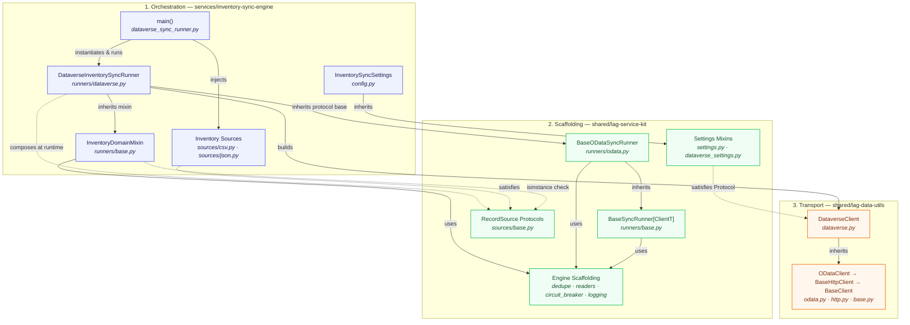

← [Back to README](../README.md)

# Architecture Deep-Dive

The full rationale behind the repository's three-layer split, and the
layering technique used for each axis of variation the sync engine
supports.

## Table of Contents

- [Layer Diagram](#layer-diagram)
- [The Three Axes](#the-three-axes)
- [Three Layered Approach](#three-layered-approach)
- [Layering Patterns](#layering-patterns)
  - [Our Example: LAG Service Kit](#our-example-lag-service-kit)

## Layer Diagram

The repository is split into three layers, supporting separation of concerns.
Each layer holds a single responsibility and one-way dependency on the layer
below it. This is a structural view, consolidated to the components that
define each layer's boundary — file-level detail (e.g. every constant in
`defaults.py`) lives in the table and prose below, not in the diagram:

The one dotted edge crossing from the scaffolding layer down to the
transport layer (`KIT_SET -.->|satisfies Protocol| DV`) is deliberate,
not an exception to the rule: `DataverseClient.from_settings()` defines
a `typing.Protocol` *inside `lag-data-utils` itself*, describing only
the shape it needs (four string attributes). `lag-service-kit`'s
concrete settings mixin happens to match that shape — the arrow shows
the middle layer reaching down to satisfy a contract the bottom layer
defined, not the bottom layer reaching up. No import exists in either
direction between the two files; see
[Protocols & Typing](design-decisions/protocols-and-typing.md#from_settings-and-structural-typing)
for the full mechanism.

| Layer | Package | Owns | Must never contain |
|---|---|---|---|
| Transport | `shared/lag-data-utils` | HTTP mechanics (`BaseHttpClient` — pooling, timeout, retry-with-backoff), OData v4 CRUD (`ODataClient`), MSAL auth, Dataverse-specific headers, the `AuthenticationError` hierarchy | Environment reads, a config framework, business logic |
| Scaffolding | `shared/lag-service-kit` | Settings base classes, structured logging, input-format readers (including chunked CSV reading), generic dedup (whole-DataFrame and chunked), a generic `ConsecutiveFailureCircuitBreaker`, the source- and destination-agnostic `BaseSyncRunner` orchestration algorithm (generic over the transport client type), the OData v4 write-protocol base `BaseODataSyncRunner` (concurrent upsert loop + circuit breaker, reusable by any OData destination), and the `RecordSource`/`ChunkedRecordSource` source-composition protocols | Dataverse-specific, inventory-specific, or source-format-specific knowledge; any baked-in default number tuned to one service (see `defaults.py`) |
| Orchestration | `services/inventory-sync-engine` | Two independent things that combine, never duplicate: the domain mixin `InventoryDomainMixin` (dedup, source binding, inventory-domain-specific) and one destination leaf class per target system (`DataverseInventorySyncRunner`, combining the mixin with `lag_service_kit`'s shared write-protocol base) — plus, on a wholly separate axis, one `RecordSource` implementation per feed format (`CsvInventorySource`, the only one that also satisfies the optional `ChunkedRecordSource` capability, and `JsonInventorySource`), composed into a runner by the caller. `defaults.py` holds every constructor default tuned to this service specifically | Anything reusable by a service that isn't this one |

## The Three Axes

Three axes vary independently here, and each stays a single point of
definition:

- **Source format** (`sources/`) — composed into a runner at
  construction time, never inherited.
- **Write protocol** (`lag_service_kit/runners/odata.py`, and future
  siblings) — a base class per protocol, combined into a leaf via
  multiple inheritance. Lives in the shared scaffolding layer, not the
  service, since it carries no domain- or service-specific knowledge.
- **Destination system** (`runners/dataverse.py`, and future siblings) —
  the leaf class itself, combining one domain mixin with one protocol
  base.

A runner is *given* a source object; it never subclasses one. A
destination leaf *combines with* a protocol base via multiple
inheritance, rather than reimplementing the write loop. The
write loop and the domain/dedup logic are both class-level, structural
concerns fixed for the lifetime of that leaf class — unlike the source,
which is a per-run operational choice.

## Three Layered Approach

A typical split calls for "library vs. application" — transport code in
`lag-data-utils`, everything else in the service. That approach fails to
support additional services (e.g., config loading, logging setup, and
the source file DataFrame conversion used to support record deduplication).
Under a traditional split, each new service would result in duplicated code
or a bloated transport layer — compromising the clean boundaries of
`lag-data-utils` and preventing delivery of a clean and maintainable
transport layer.

`lag-service-kit` exists to hold code and logic that is reusable across
*any* future service, independent of any transport concern. This approach
prevents transport layer dependency on any specific configuration framework.

Concretely:

- `lag-data-utils` has zero dependency on Pydantic or any settings library.
  `DataverseClient.from_settings()` is typed against a structural
  `typing.Protocol` (`DataverseConnectionSettings` in `dataverse.py`) —
  any object exposing the right four attributes works, regardless of what
  produced it.
- `lag-service-kit` depends on Pydantic and pandas, but knows nothing about
  Dataverse alternate keys or inventory columns — any service that talks to
  a different destination system or ingests a different kind of record can
  leverage this kit out of the box.
- The service's destination-specific leaf class is the thinnest layer — housing
  specific implementations for the destination system.
    - `DataverseInventorySyncRunner` (`runners/dataverse.py`) contributes
    only methods specific to Microsoft Dataverse integrations: `entity_set`,
    `alternate_key_field`, `load_settings()`, `build_client()`, and
    `build_payload()`.
    - It does **not** inherit its source feed. The feed format a run reads
    is set at construction time (e.g.
    `DataverseInventorySyncRunner(source=CsvInventorySource())`) in
    `dataverse_sync_runner.py` — via any object satisfying the
    `lag_service_kit.sources.base.RecordSource` protocol. A destination
    inheriting from a source class would fix that destination to one feed
    format forever; composition lets the same `DataverseInventorySyncRunner`
    read CSV or JSON — both ship today, see `sources/csv.py` and
    `sources/json.py` — with no new class.
    - It **does** inherit two independent bases, combined via multiple
    inheritance: `InventoryDomainMixin` (`runners/base.py` — dedup, source
    binding, inventory-domain-specific) and
    `lag_service_kit.runners.odata.BaseODataSyncRunner` (the OData v4
    upsert loop — destination/domain-agnostic, shared scaffolding).
    Neither base depends on or duplicates the other; a class combining
    both gets dedup, source binding, and the write loop with each
    defined in exactly one place.
    - `dataverse_sync_runner.py` is reduced to implementation-specific business
    logic - identifying the leaf class to instantiate, which source to pair
    it with, and running it.

## Layering Patterns

The transport hierarchy (`BaseClient` → `ODataClient` → `DataverseClient`)
goes beyond simply being reserved for connectors. Services like the sync runner
are built the same way, for the axis that genuinely is a hierarchy.
  - A base class owns core implementation pieces that are vital to any
  integration and rarely vary.
  - Each concrete class inheriting from the base class and other mid-layer
  abstractions contributes methods and state specific to the subject
  implementation.

Not every axis of variation is a hierarchy, though. Where two axes vary
*independently* — as source format and destination system do here —
forcing them into one inheritance chain produces either a combinatorial
explosion of classes (`CsvDataverseRunner`, `JsonDataverseRunner`,
`CsvSapRunner`, `JsonSapRunner`, ...) or an arbitrary, incorrect coupling
(a destination that can only ever read one feed format). The sync runner
therefore uses inheritance for the destination axis and composition for
the source axis.

### Our Example: LAG Service Kit

The Service Kit combines three techniques, one per axis of variation:
dependency injection for the source (an operational, per-run choice),
mixin composition for domain logic and write protocol (two class-level
concerns that must each stay defined exactly once), and template methods
for the parts every run requires regardless of axis.

- `lag_service_kit.runners.base.BaseSyncRunner` — the outermost, fully
  generic layer. Knows the *shape* of a sync run (core execution flow:
  load settings → configure logging → authenticate → read records →
  write records → report results) but makes no direct implementation or
  reference to the shape or type of the source or destination.
  It lives in the kit in lieu of any particular service
  to support other service implementations that require this same shape.
  It is generic over `ClientT` (bound to `lag_data_utils.clients.base.BaseClient`),
  so every subclass in a given hierarchy agrees on one concrete client
  type for `build_client()` and `sync_records()`, rather than each
  narrowing it independently.
- `services/inventory-sync-engine/runners/base.py:InventoryDomainMixin`
  — the inventory-domain layer. Knows what an inventory record is
  (e.g., `sku_id`, `item_name`, `unit_price`) and how to dedupe it. Knows
  nothing about the source feed, wire protocol, or destination.
  Its constructor takes a `source: RecordSource` collaborator,
  while `load_records()` calls `self.source.read_records()`.
  It does not inherit `BaseSyncRunner` and commits to no `ClientT`.
  It is a bare mixin combined into a leaf class via multiple inheritance
  alongside the leaf's required protocol. This is the one class in the
  whole chain that's genuinely specific to this service — every other
  class described below lives in `lag_service_kit`, promoted there
  precisely because it carries no inventory-specific knowledge at all.
- `lag_service_kit.runners.odata:BaseODataSyncRunner`
  — the write-protocol layer, `BaseSyncRunner[ODataClient]`. Knows how to
  drive the generic `upsert_record` loop against *any* OData v4 client,
  given `entity_set`, `alternate_key_field`, and `build_payload()` from
  a destination leaf. Knows nothing about dedup, source feeds, or any
  particular domain — those come from whichever domain mixin the leaf
  inherits. `dedupe_key` is declared here (for the one line in
  `sync_records()` that needs a record's business-key column) but never
  assigned here — a domain mixin is the only place that value is set, so
  it is never duplicated. `sync_records()` dispatches up to
  `max_workers` upserts concurrently via `ThreadPoolExecutor`, and
  builds one `lag_service_kit.circuit_breaker.ConsecutiveFailureCircuitBreaker`
  per run to stop dispatching further requests after
  `failure_threshold` consecutive failures — both are protocol-level
  concerns, not domain or destination knowledge, so they live here too.
  Lives in `lag_service_kit`, not the inventory service: a future
  "orders" or "customers" sync service inherits this exact class
  unchanged, writing only its own domain mixin and destination leaf.
- `lag_service_kit.sources.base:RecordSource` — a
  `typing.Protocol`, not a base class. Fixes only the shape
  (`read_records() -> pd.DataFrame`) that any source must expose. A
  sibling protocol in the same module, `ChunkedRecordSource`, adds an
  optional `read_record_chunks()` capability that only a source able to
  genuinely stream in bounded memory need implement — `CsvInventorySource`
  does; `JsonInventorySource` does not, and simply isn't checked via
  `isinstance` against it. Lives in `lag_service_kit` alongside
  `BaseODataSyncRunner`, for the same reason: the contract itself has
  no inventory-specific knowledge, only the concrete implementations do.
- `services/inventory-sync-engine/sources/csv.py:CsvInventorySource` —
  the source-format implementation. The only code in the service that
  knows how to read the ERP CSV feed. Knows nothing about
  `InventoryDomainMixin`, Dataverse, or any destination — it isn't even
  in the `runners` package.
- `services/inventory-sync-engine/runners/dataverse.py:DataverseInventorySyncRunner`
  — the destination leaf: `class DataverseInventorySyncRunner(InventoryDomainMixin, BaseODataSyncRunner)`.
  The only code in the service that knows `lagsol_inventoryitems`,
  `lagsol_skuid`, and the `lagsol_` field mapping. It has no relationship
  to `CsvInventorySource` in its class definition at all.
- `services/inventory-sync-engine/dataverse_sync_runner.py:main()` — the
  one place that pairs a destination with a source for a given run:
  `DataverseInventorySyncRunner(source=CsvInventorySource())`.

Adding a second destination that also speaks OData v4 — SAP S/4HANA
Cloud, SharePoint Online — means writing a sibling leaf class (e.g.
`runners/sap.py`) combining the same two bases,
`class SapInventorySyncRunner(InventoryDomainMixin, BaseODataSyncRunner)`,
and supplying its own settings, client, entity set, alternate key,
and payload mapping — importing `BaseODataSyncRunner` straight from
`lag_service_kit`, with nothing to duplicate. Its entrypoint composes
it with whichever source it needs. Adding a destination that speaks a
genuinely different wire protocol (e.g., SOAP, a bulk-upload REST API,
etc.) means writing a sibling protocol base in `lag_service_kit` itself
(e.g. `lag_service_kit.runners.soap:BaseSoapSyncRunner(BaseSyncRunner[SoapClient])`)
with its own hooks and write loop — promoted there the same way
`BaseODataSyncRunner` already is, since a write-protocol base is
domain-agnostic by construction. Its leaf class still inherits
`InventoryDomainMixin` unchanged, so dedup and source binding are never
reimplemented for a new protocol. A second source format is a sibling
source class implementing only `read_records()` — `sources/json.py:JsonInventorySource`
ships today alongside `CsvInventorySource`; a Parquet drop would be the
same shape again. `DataverseInventorySyncRunner(source=JsonInventorySource())`
reads the JSON mock feed and produces byte-for-byte identical
deduplicated records to `DataverseInventorySyncRunner(source=CsvInventorySource())`
against the same mock dataset, with no new subclass. Neither
`BaseSyncRunner`, `BaseODataSyncRunner`, `InventoryDomainMixin`, nor any
protocol base changes to support a new instance of any axis, and the
three axes never multiply against each other, thus preventing
combinatorial explosion. Adding an entirely new *service* — orders,
customers — means writing only that service's own domain mixin,
destination leaf, and source implementations; the write-protocol base
and source-composition contract are already there, unchanged, waiting
to be inherited.

---

← [Back to README](../README.md)
