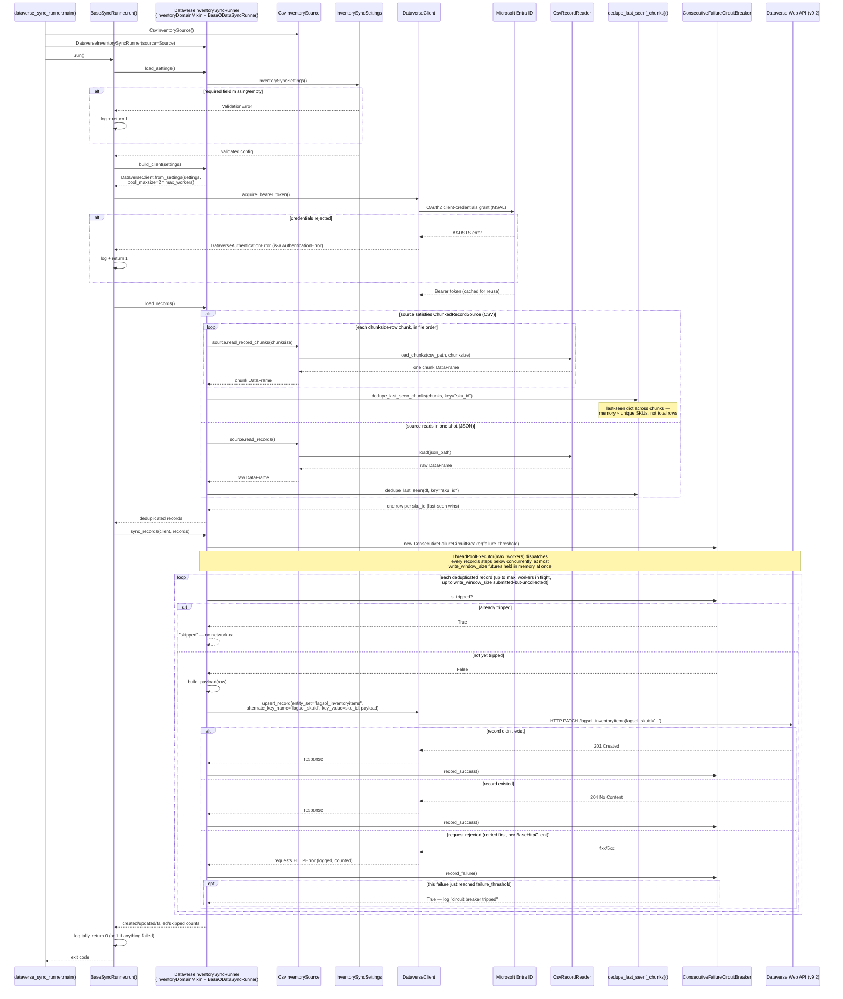

← [Back to README](../README.md)

# Execution Flow

A single sync run, from `main()` to a final exit code — settings
validation, MSAL authentication, format-agnostic chunked read + dedupe,
and the concurrent, circuit-breaker-guarded upsert loop.

Re-running the sync is safe by construction: `upsert_record` issues an
`HTTP PATCH` against the `lagsol_skuid` alternate key, which is itself the
idempotency guarantee (OData v4 upsert semantics) — there is no
read-then-decide step that a second run could race against.

---

← [Back to README](../README.md)
